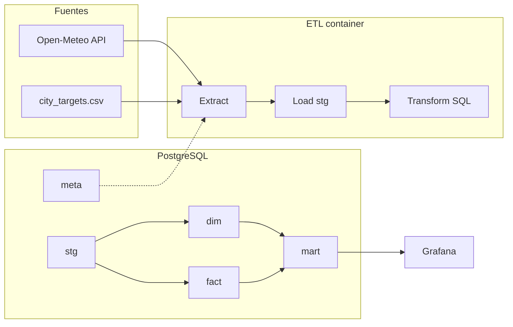

# Roadmap: mini data warehouse clima + Grafana

Stack objetivo: **Python 3.12**, **PostgreSQL 16**, **Grafana**, **Docker Compose**. Patrón **staging → dimensiones/hechos → marts** con trazabilidad de corridas ETL.

**Estado:** Fase 0 implementada en repo (`docker-compose`, DDL, paquete `weather_dw`, CSV de targets, provisioning Grafana). Ejecutar: ver [README.md](./README.md).

---

## Fase 0 — Fundación (actual)

| Ítem | Detalle |
|------|---------|
| Infra | `docker-compose.yml`: servicios `postgres`, `grafana`, `etl` (job batch). Red interna, volúmenes persistentes. |
| Esquema | Schemas: `meta` (corridas), `stg` (landed raw/normalized), `dim`, `fact`, `mart` (consumo BI/alertas). |
| Contrato datos | `data/targets/city_targets.csv` = sustituto de “Google Sheets” (umbrales por ciudad). |
| API | Open-Meteo Forecast + Geocoding (sin API key en uso básico). |
| ETL | Paquete `weather_dw`: configuración por env, logging estructurado, transacciones, idempotencia por `run_id`. |
| Transform | SQL versionado en repo ejecutado desde Python (`transform/runner.py`). |
| Observabilidad | Tabla `meta.etl_runs` + logs stdout (JSON opcional en fase posterior). |

**Criterio de hecho:** `docker compose run --rm etl` completa en verde; Grafana muestra datasource Postgres; consultas a `mart.*` devuelven filas.

---

## Fase 1 — Semana 1 (MVP visible)

| Ítem | Detalle |
|------|---------|
| Ingesta | Extracción forecast horario por ciudad (lat/lon desde CSV o geocoding si faltan coordenadas). |
| Staging | `stg.stg_open_meteo_hourly`: append por `run_id` (historial de pronósticos descargados). |
| Dimensiones | `dim.dim_city` desde CSV (SCD0: upsert por `city_id`). |
| Hechos | `fact.fact_weather_hourly_forecast`: población desde última corrida exitosa o ventana explícita (documentada). |
| Mart | `mart.mart_city_hourly_risk`: reglas de negocio (códigos WMO tormenta + umbrales CSV). |
| Grafana | 3–4 paneles: tabla ciudades en riesgo, time series precipitación/código, stat “alertas activas”. |
| Documentación | README con diagrama Mermaid y variables `.env`. |

**Criterio de hecho:** dashboard refleja última corrida; README permite reproducir en máquina limpia.

---

## Fase 2 — Semana 2 (multi-fuente + KPIs cruzados)

| Ítem | Detalle |
|------|---------|
| Segunda fuente | Ej.: Open-Meteo **Archive** (histórico 1 día) **o** segundo endpoint (p. ej. daily summary) como `stg` adicional. |
| Modelo | Joins explícitos en `mart` (anomalía vs. clima histórico o comparación daily vs hourly). |
| KPIs | Campos calculados en SQL (ventanas `LEAD`/`LAG` entre ciudades para heurística “propagación” demo). |
| Calidad | Checks mínimos: filas esperadas por ciudad, nulls críticos, `meta.etl_runs` con `status=failed` ante error HTTP. |

**Criterio de hecho:** al menos un panel Grafana usa métrica cruzada (dos fuentes o dos granularidades).

---

## Fase 3 — Orquestación “estilo Airbyte/Fivetran”

| Ítem | Detalle |
|------|---------|
| Scheduler | `cron` en contenedor dedicado **o** **Prefect** / **Dagster** (OSS) con un flow que invoque el mismo entrypoint. |
| Lineage ligero | Tags `source_system`, `entity` en tablas stg; comentarios en SQL. |
| Secrets | Solo `.env` / Docker secrets; sin credenciales en imagen. |

**Criterio de hecho:** pipeline programado (p. ej. cada 15 min / hora) sin intervención manual.

---

## Fase 4 — Alertas y hardening (portfolio “producción light”)

| Ítem | Detalle |
|------|---------|
| Grafana Alerting | Reglas sobre consultas al `mart` (umbral de `risk_score`, conteo ciudades en alerta). |
| Roles DB | Usuario lectura solo `mart` (+ `dim` si hace falta) para Grafana. |
| CI | GitHub Actions: lint (`ruff`), `docker compose config`, smoke test ETL contra Postgres servicio. |

---

## Diagrama de flujo (objetivo)

---

## Decisiones técnicas fijadas

1. **Incremental:** cada corrida genera `run_id`; `stg` conserva historial de extracciones; `mart` expone **última corrida exitosa** (vía `meta.etl_runs` + join o `processed_up_to_run_id` en comentarios SQL).
2. **Transformaciones preferentemente en SQL** (auditable, portable a dbt en el futuro sin rehacer lógica de negocio).
3. **Sin PII:** solo datos meteorológicos públicos y catálogo de ciudades.

---

## Referencias útiles

- [Open-Meteo Forecast API](https://open-meteo.com/en/docs)
- [WMO Weather interpretation codes](https://open-meteo.com/en/docs) (tabla en documentación)
- [Grafana PostgreSQL data source](https://grafana.com/docs/grafana/latest/datasources/postgres/)
